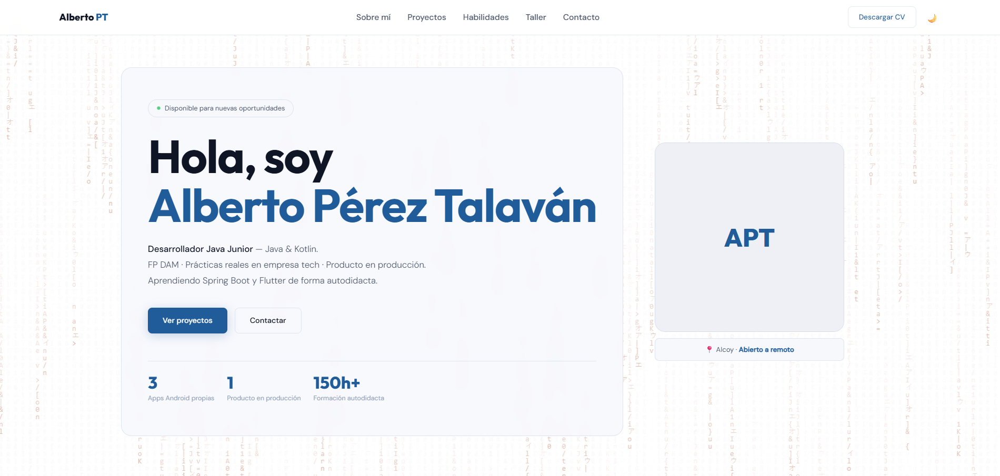
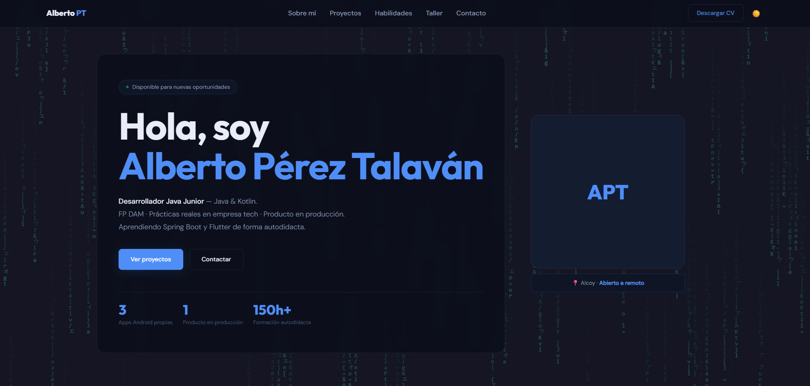

<div align="center">

# 🧑‍💻 Alberto Pérez Talaván — Portfolio Web


**Portfolio personal · Desarrollador Java Junior · Android nativo · Java & Kotlin**

[🌐 Ver en vivo](https://albertopt-dev.github.io) · [📬 Contactar](mailto:alberto.pt.dev@gmail.com) · [💼 LinkedIn](https://linkedin.com/in/alberto-perez-talavan) · [ GitHub](https://github.com/albertopt-dev)

</div>

---

## 📋 Tabla de contenidos

1. [Descripción](#-descripción)
2. [Demo y capturas](#-demo-y-capturas)
3. [Características](#-características)
4. [Tecnologías y dependencias](#-tecnologías-y-dependencias)
5. [Estructura del proyecto](#-estructura-del-proyecto)
6. [Secciones de la web](#-secciones-de-la-web)
7. [Instalación y uso local](#-instalación-y-uso-local)
8. [Guía de personalización](#-guía-de-personalización)
   - [Añadir un proyecto](#añadir-un-proyecto)
   - [Añadir un Lab / experimento](#añadir-un-lab--experimento)
   - [Añadir una habilidad al stack](#añadir-una-habilidad-al-stack)
   - [Cambiar la foto de perfil](#cambiar-la-foto-de-perfil)
9. [Diseño y sistema de tokens CSS](#-diseño-y-sistema-de-tokens-css)
10. [Modo oscuro / claro](#-modo-oscuro--claro)
11. [Animación de fondo — Matrix Rain](#-animación-de-fondo--matrix-rain)
12. [Responsive design](#-responsive-design)
13. [Accesibilidad](#-accesibilidad)
14. [Soporte de navegadores](#-soporte-de-navegadores)
15. [Licencia](#-licencia)

---

## 📖 Descripción

Portfolio web **completamente estático** (HTML + CSS + JS vanilla, sin frameworks ni bundlers) diseñado para mostrar mi perfil profesional como Desarrollador Java Junior. El objetivo era construir algo desde cero, con código limpio, rendimiento nativo y un diseño cuidado que refleje mi nivel de atención al detalle.

Puntos clave del proyecto:
- **Cero dependencias de framework** — todo vanilla, sin React, Vue, ni bundler.
- **Datos centralizados en `app.js`** — proyectos, labs y skills se definen como arrays JS y se renderizan dinámicamente, así añadir nueva información es trivial.
- **Dark / Light theme** con persistencia en `localStorage` y detección automática de preferencia del sistema operativo.
- **Formulario de contacto funcional** integrado con EmailJS, sin backend propio.
- **Animación generativa** en el hero (Matrix Rain con paleta cromática cíclica).

---

## 🖼️ Demo y capturas

> Puedes ver el portfolio en vivo en: **[albertopt-dev.github.io](https://albertopt-dev.github.io)**

| Modo claro | Modo oscuro |
|:---:|:---:|
|  |  |

---

## ✨ Características

| Característica | Detalle |
|---|---|
| 🎨 **Dark / Light mode** | Toggle manual + detección de `prefers-color-scheme` + persistencia `localStorage` |
| 🌧️ **Matrix Rain animado** | Canvas generativo con caracteres Java/Kotlin, runas y código. Paleta de color cíclica `hsl` |
| 🃏 **Tarjetas de proyectos dinámicas** | Renderizadas desde un array JS con estado (`terminado`, `en-proceso`, `próximamente`) |
| 🔍 **Modal de detalle** | Muestra título, descripción, highlights, stack y links. Cierra con Escape o clic en backdrop |
| ↔️ **Skills scroller** | Carrusel horizontal con flechas y scroll suave; oculta/muestra flechas según el scroll |
| 📬 **Formulario de contacto** | EmailJS — envío directo al email sin backend. Feedback visual de éxito/error |
| 📱 **Responsive** | Breakpoint en 768 px, menú hamburguesa en móvil, juego optimizado para táctil |
| ♿ **Accesibilidad** | `aria-label`, `aria-hidden`, `role="dialog"`, `aria-modal`, `aria-live="polite"` |
| ⚡ **Sin build step** | Abrir `index.html` en el navegador (o servir con cualquier servidor estático) |
| 📄 **CV descargable** | Enlace en la navbar que descarga el PDF directamente |

---

## 🛠️ Tecnologías y dependencias

### Stack principal

| Tecnología | Versión / Fuente | Uso |
|---|---|---|
| **HTML5** | Nativo | Estructura semántica |
| **CSS3** | Nativo | Estilos, custom properties, animaciones |
| **JavaScript ES2020** | Nativo | Lógica, render dinámico, interactividad |

### Dependencias externas (CDN — sin npm)

| Librería | CDN | Propósito |
|---|---|---|
| [Devicons](https://devicon.dev/) | `jsdelivr` v2.16.0 | Iconos de tecnologías en stack y labs |
| [Google Fonts](https://fonts.google.com/) | `fonts.googleapis.com` | Fuentes: `Outfit` (display) + `DM Sans` (body) |
| [EmailJS Browser SDK](https://www.emailjs.com/) | `jsdelivr` v4 | Envío del formulario de contacto |

**No hay `package.json`, `node_modules`, ni proceso de build.** Todas las dependencias se cargan vía `<link>` y `<script>` en el `<head>`.

---

## 📁 Estructura del proyecto

```
portfolio-web/
│
├── index.html              # Estructura HTML completa (nav, secciones, modal, footer)
├── styles.css              # Todos los estilos (tokens, componentes, responsive)
├── app.js                  # Datos + lógica: render de proyectos, labs, skills, tema, EmailJS
├── favicon.svg             # Favicon SVG
│
└── assets/
    ├── foto.png                                   # Foto de perfil del hero
    ├── Alberto_Pérez_Talaván_CV_2025.pdf           # CV descargable
    ├── Carta recomendación Tich Consulting.pdf     # Carta de recomendación
    ├── Carta de presentacion.pdf                   # Carta de presentación
    └── proyectos/                                  # Imágenes preview de proyectos (opcional)
```

### Descripción de cada archivo

#### `index.html`
Contiene toda la estructura semántica de la web. Las secciones de proyectos, labs y skills **no tienen HTML fijo** — solo tienen un `<div id="...Grid">` vacío que `app.js` rellena al cargar. Los datos de contenido están en `app.js`.

#### `styles.css`
Sistema de diseño completo organizado por secciones. Usa **CSS custom properties** (tokens) para toda la paleta de colores, sombras, radios y transiciones. Cambiar el color de acento del portfolio es tan simple como modificar `--accent` en `:root`.

#### `app.js`
Archivo central que contiene:
- **Arrays de datos**: `projects`, `labs`, `skills`
- **Funciones de render**: `renderProjects()`, `renderLabs()`, `renderSkills()`
- **Lógica del modal**: `openProjectModal()`, `closeProjectModal()`
- **Skills scroller**: `initSkillsScroller()`
- **Tema**: `initTheme()`
- **Formulario**: `initContactEmailJS()`
- **Navegación suave**: `initNav()`

---

## 🗂️ Secciones de la web

### 1. `#hero` — Presentación
- Badge animado "Disponible para nuevas oportunidades" con punto pulsante verde.
- Título, subtítulo con especialidad y stack.
- CTAs: *Ver proyectos* y *Contactar*.
- Estadísticas rápidas: apps propias, producto en producción, horas de formación.
- Avatar con fallback de iniciales si la imagen no carga.
- Fondo Canvas con Matrix Rain.

### 2. `#sobre-mi` — Sobre mí
- Texto biográfico en tres párrafos (experiencia I+D, FP DAM + prácticas, especialización).
- Enlace a la carta de recomendación de TICH Consulting (PDF en nueva pestaña).
- Grid de tarjetas de habilidades con etiqueta de nivel (dominado vs. aprendizaje).

### 3. `#proyectos` — Proyectos
- Grid responsive de tarjetas generadas dinámicamente.
- Badges de estado: `✓ Terminado` (azul), `🔧 En desarrollo` (amarillo), `⭐ Destacado`.
- Tarjeta "Próximamente" con borde discontinuo para los slots vacíos.
- Botón "Ver detalles" abre el modal; botón "Repo" lleva al repositorio en GitHub.

### 4. `#habilidades` — Habilidades
- Carrusel horizontal con tarjetas de iconos (Devicons).
- Flechas ❮ ❯ con scroll suave. La flecha izquierda aparece deshabilitada cuando estás al inicio.
- Stack: Java, Kotlin, JavaScript, MySQL, Firebase, WordPress, Laravel, PHP, Postman, Spring, HTML5, CSS3, Git, Android.

### 5. `#taller` — El taller (Labs)
- Proyectos personales y experimentos sin cliente ni fecha límite.
- Cards con iconos de tecnologías, descripción y enlace al repositorio.

### 6. `#juego` — Mini juego: Flappy Dev
- Minijuego tipo Flappy Bird integrado en el portfolio.
- Personaje pixel art (desarrollador), obstáculos `{ }` neón y fondo de ciudad cyberpunk generados con Canvas.
- Controles: **Espacio**, clic o toque en pantalla para saltar. HUD con puntuación y récord de sesión.
- > 🤖 Esta sección fue desarrollada con ayuda de IA (GitHub Copilot).

### 7. `#contacto` — Contacto
- Links directos a email, LinkedIn y GitHub.
- Formulario con campos Nombre, Email y Mensaje — integrado con EmailJS.
- Feedback accesible con `aria-live="polite"`.

---

## 🚀 Instalación y uso local

Este proyecto **no requiere ningún proceso de instalación**. Al no tener dependencias npm ni build step, basta con clonar el repositorio y abrir `index.html` directamente en el navegador, o servirlo con cualquier servidor estático local como el servidor integrado de Python o `npx serve`.

---

## 🎨 Guía de personalización

Toda la información del portfolio está centralizada en el array al inicio de `app.js`. **No es necesario tocar el HTML** para actualizar el contenido.

### Añadir un proyecto

En `app.js`, añade un nuevo objeto al array `projects` con los campos: `id` (único), `title`, `description`, `tags` (categorías), `stacks` (tecnologías), `status`, `image` (ruta o cadena vacía para usar las iniciales), `featured`, `highlights` (lista de puntos clave para el modal) y `links` con `repo` y `demo`.

**Estados disponibles:**

| `status` | Apariencia |
|---|---|
| `"terminado"` | Badge azul `✓ Terminado` |
| `"en-proceso"` | Badge amarillo `🔧 En desarrollo` |
| `"coming"` | Tarjeta con borde discontinuo "Próximamente" |

### Añadir un Lab / experimento

En `app.js`, añade un nuevo objeto al array `labs` con los campos: `title`, `description`, las clases de los iconos de [devicon.dev](https://devicon.dev/) en el array `iconClasses`, y la URL del repositorio en `links.repo` (cadena vacía si no hay repo público).

### Añadir una habilidad al stack

En `app.js`, añade un nuevo objeto al array `skills` con el nombre de la tecnología y su clase de icono de [devicon.dev](https://devicon.dev/). Busca la tecnología en esa web, haz clic en el icono y copia la clase.

### Cambiar la foto de perfil

Reemplaza el archivo `assets/foto.png` con tu foto. La imagen se recorta con `object-fit: cover` centrado en la parte superior (`object-position: top`), por lo que las fotos verticales tipo carnet funcionan perfectamente.

Si la imagen no carga (o mientras no exista), el fallback muestra automáticamente las iniciales **APT** en el frame del avatar.

---

## 🎨 Diseño y sistema de tokens CSS

Todos los valores de diseño están definidos como **CSS custom properties** en `:root` dentro de `styles.css`: paleta de colores (`--accent`, `--bg`, `--text` y sus variantes), tipografías, radios de borde, sombras y duración de transiciones. Para cambiar el color de acento o cualquier otro valor visual del portfolio basta con editar el token correspondiente en `:root`. El modo oscuro sobreescribe únicamente los tokens de color bajo la clase `.dark`.

---

## 🌙 Modo oscuro / claro

El sistema de tema funciona en tres capas:

1. **Detección automática** — Al cargar la página, lee `prefers-color-scheme: dark` del sistema operativo.
2. **Persistencia manual** — Si el usuario cambia el tema con el botón 🌙/☀️, la preferencia se guarda en `localStorage` bajo la clave `"theme"` y tiene prioridad sobre la detección del sistema.
3. **Transición suave** — Todos los cambios de color usan `transition: background 0.25s ease, color 0.25s ease`.

La clase `.dark` se añade/elimina en `<html>` y los tokens CSS del modo oscuro la sobreescriben automáticamente.

---

## 🌧️ Animación de fondo — Matrix Rain

El hero incluye un canvas con una animación generativa inspirada en el Matrix rain, personalizada con el vocabulario de un desarrollador: dígitos binarios, runas japonesas y palabras clave de Java/Kotlin. La paleta de color cicla en tono HSL de forma continua y se adapta automáticamente al modo claro y oscuro.

**Parámetros ajustables** (al final de `index.html`, dentro del script inline):

| Variable | Valor por defecto | Efecto |
|---|---|---|
| `FONT_SIZE` | `14` | Tamaño de los caracteres en px |
| `hue` | `120` (verde) | Color inicial de la lluvia (0=rojo, 120=verde, 240=azul) |
| `hue + 0.3` | `+0.3` por frame | Velocidad del ciclo de color — aumentar para ir más rápido |
| `frameCount % 2.0` | `2.0` | Cada cuántos frames se dibuja — aumentar para ir más lento |
| `alpha` | `0.12 – 0.20` | Opacidad de los caracteres |

El fondo adapta su opacidad y color al modo claro/oscuro automáticamente.

---

## 📱 Responsive design

El portfolio está **completamente optimizado para móvil** con un breakpoint principal en `768px`:

| Viewport | Comportamiento |
|---|---|
| `> 768px` (escritorio) | Hero en fila, About en 2 columnas, navbar con links visibles |
| `≤ 768px` (móvil/tablet) | Hero en columna, foto centrada, all-sections en 1 columna, formulario en 1 columna |

### Menú hamburguesa

En móvil los links de navegación se ocultan y aparece un **botón hamburguesa** (☰) a la izquierda del logo:

- Las tres líneas animadas se transforman en una ✕ al abrirse.
- El menú desplegable muestra todas las secciones con fondo degradado azul que combina con la navbar.
- Se cierra automáticamente al pulsar un enlace o al tocar fuera.

### Optimizaciones móvil del mini juego

- Canvas con **altura fija de 280 px** para que sea jugable con el pulgar.
- **Gap entre obstáculos ampliado** a 190 px (vs 160 px en escritorio).
- Los obstáculos aparecen con **mayor frecuencia reducida** (140 frames vs 120) para dar más tiempo de reacción.
- La instrucción de teclado (`Space`) se oculta automáticamente, ya que no aplica en táctil.
- `touch-action: none` en el canvas para evitar scroll accidental al jugar.

Los títulos principales usan `clamp()` para escalar suavemente entre tamaños de pantalla sin media queries adicionales.

---

## ♿ Accesibilidad

Medidas de accesibilidad implementadas:

- **Navegación por teclado**: el modal se cierra con `Escape`.
- **Modal semántico**: `role="dialog"`, `aria-modal="true"`, `aria-hidden` gestionado dinámicamente al abrir/cerrar.
- **Navegación**: `<nav>` con `aria-label="Navegación principal"`.
- **Botones de icono**: `aria-label` descriptivo en el botón de tema y las flechas del scroller.
- **Formulario**: `<label>` asociado a cada `<input>` mediante `for`/`id`.
- **Feedback del formulario**: `aria-live="polite"` para que los lectores de pantalla anuncien el resultado del envío.
- **Imágenes decorativas**: `aria-hidden="true"` en iconos decorativos de Devicons.
- **Alt text**: todas las imágenes con `alt` descriptivo; fallback de iniciales para la foto si no carga.

---

## 🌐 Soporte de navegadores

| Navegador | Soporte |
|---|---|
| Chrome / Edge 90+ | ✅ Completo |
| Firefox 90+ | ✅ Completo |
| Safari 15+ | ✅ Completo |
| Opera 75+ | ✅ Completo |
| IE 11 | ❌ No soportado (uso de custom properties, `clamp()`, `backdrop-filter`) |

---

## 📄 Licencia

Este proyecto está publicado bajo la licencia **MIT**. Puedes usarlo, modificarlo y distribuirlo libremente siempre que incluyas el aviso de copyright original.

---

<div align="center">

Hecho con paciencia y mucho café por **Alberto Pérez Talaván**

[📬 alberto.pt.dev@gmail.com](https://mail.google.com/mail/?view=cm&to=alberto.pt.dev@gmail.com) · [💼 LinkedIn](https://linkedin.com/in/alberto-perez-talavan) · [ GitHub](https://github.com/albertopt-dev)

</div>
